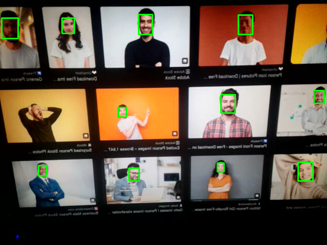

# Face Detection with Python (MTCNN + OpenCV)

This is a real-time **multi-face detection** project built with Python using the **MTCNN (Multi-task Cascaded Convolutional Networks)** deep learning model and **OpenCV**.

It captures live video from your webcam, detects all faces in the frame, and draws bounding boxes around them.

---

## 🚀 Features

- Detects **multiple faces** in real-time
- Uses **MTCNN** for high accuracy
- Draws bounding boxes around detected faces
- Webcam support (can be extended for image/video input)
- Clean and easy-to-understand Python code

---

## 🖼️ Demo



---

## 🧠 Requirements

- Python 3.7+
- OpenCV
- TensorFlow (CPU version recommended)
- MTCNN

---

## ⚙️ Installation

```bash
git clone https://github.com/hiddent3erminal/accurate-face-detection.git
cd accurate-face-detection

# Install dependencies
pip install -r requirements.txt
```

> ✅ If you’re on a CPU-only system, we recommend installing `tensorflow-cpu` for better compatibility.

---

## ▶️ Usage

```bash
python3 main.py
```

Press `Q` to quit the webcam window.

---

## 📂 File Structure

```
.
├── main.py                # Main Python script for webcam face detection
├── requirements.txt       # Python dependencies
├── README.md              # Project description
└── samples/
    └── screenshot.jpg        # Demo image
```

---

## 📌 TODO (optional)

- [ ] Add support for image or video file input
- [ ] Add option to save cropped face images
- [ ] Add face recognition or age/gender/emotion detection
- [ ] Build a simple GUI

---

## 🧑‍💻 Author

**Hiddent3erminal**  
🧠 Python & AI Enthusiast
📧 Feel free to contribute, fork, or give feedback!

---

## 📜 License

MIT License
